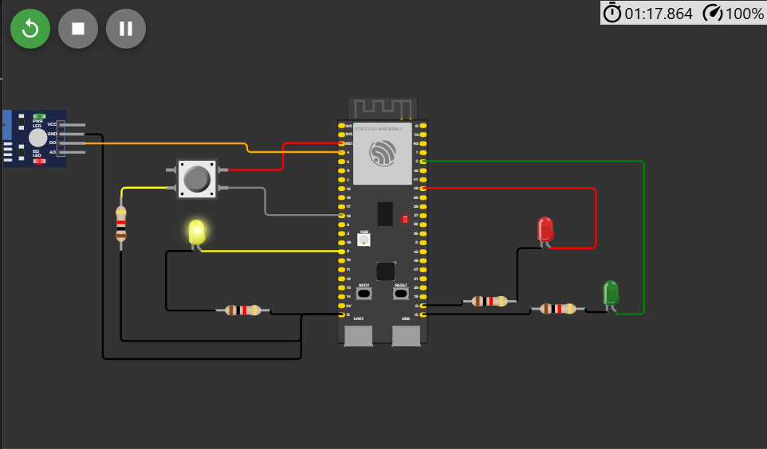
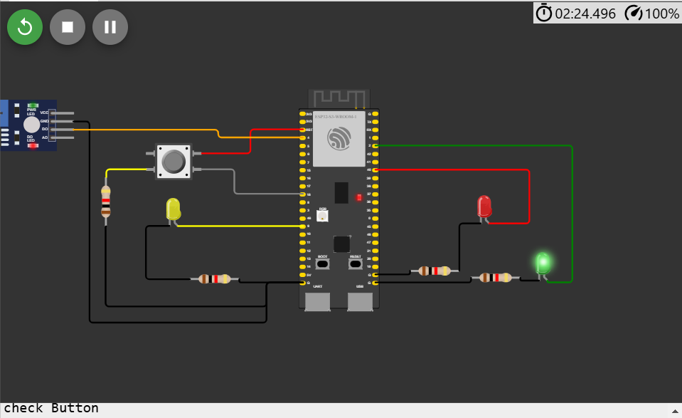
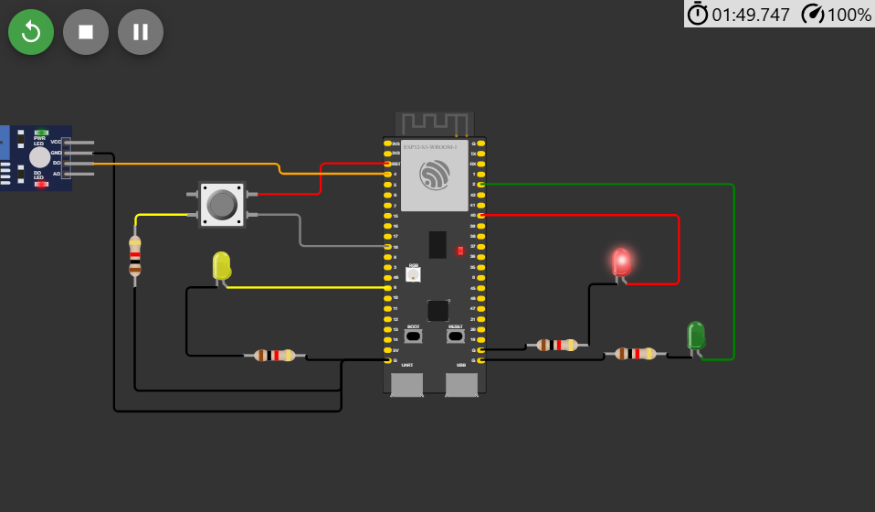

# Semáforo Inteligente

&nbsp;&nbsp;&nbsp;&nbsp;O semáforo ele consiste em algumas funções. Sendo elas:

- Caso esteja escuro o led amarelo fica piscando;
- Caso esteja claro o semáforo funciona normalmente;
- Caso esteja claro, esteja no farol vermelho e o botão é acionado o semáforo abre após 1s;
- Caso o botão seja pressionado 3 vezes ele envia um alerta;

 

Figura 1 - Led amarelo piscando
 
 

 
 

 

 

Figura 2 - Led verde acesso quando botão foi pressionado
 
 

 
 

 

 

Figura 3 - Led vermelho acesso
 
 

 
 

 
